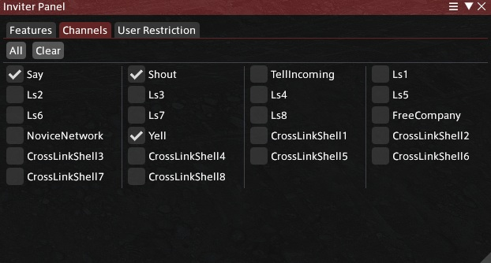
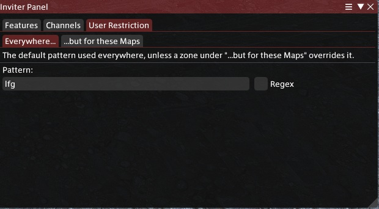
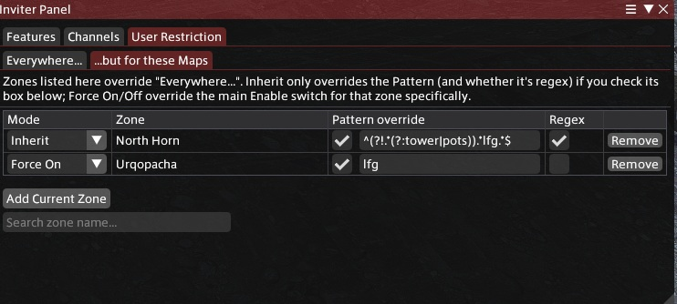

# Inviter
[](https://github.com/MakorVihar/Inviter/actions/workflows/build.yml)


A [Dalamud](https://dalamud.dev) plugin that automatically invites players who say a matching phrase in chat to your party.

This is a fork of [Bluefissure/Inviter](https://github.com/Bluefissure/Inviter), updated to target the current Dalamud API and extended with a server info bar toggle, a right-click quick menu, channel filter shortcuts, and per-zone rules.

## Install

Add this repository's `repo.json` as a custom plugin repository in Dalamud: **Dalamud Settings → Experimental → Custom Plugin Repositories**:

```
https://raw.githubusercontent.com/MakorVihar/Inviter/main/repo.json
```

Then find "Inviter" under **Plugin Installer → All Plugins** and install it.

## Features

- Automatically invites players whose chat message matches a text pattern or regex you configure
- Per-channel filters, so you can pick exactly which chat channels are checked
- Per-zone rules: override the pattern (and whether it's regex) for specific zones, or force auto-invite on/off in specific zones regardless of the main switch
- A server info bar (DTR) entry showing the effective status for whatever zone you're currently in:
  - `On` / `Off` — following the main switch, no zone rule for this zone
  - `On (Inherited)` / `Off (Inherited)` — this zone has a rule, but it's set to Inherit, so it's still following the main switch
  - `On (Forced)` / `Off (Forced)` — this zone has a Force On/Off rule, overriding the main switch
  - `Timed (Xm)` — a timed session is running and currently in effect
  - **Left-click** the entry to toggle. In a Forced zone this flips the force state directly (`On (Forced)` ↔ `Off (Forced)`) without touching the main switch; everywhere else it toggles the main switch
  - **Right-click** the entry for a quick menu: turn on/off, start a timed session (with duration presets or a custom minutes/attempts input), cancel a running timed session, or open settings








## Commands

| Command | Effect |
|---|---|
| `/xinvite` | Open the settings window |
| `/xinvite on` / `/xinvite off` / `/xinvite toggle` | Turn auto-invite on/off/toggle it |
| `/xinvite <minutes>` | Enable auto-invite for a set number of minutes |
| `/xinvite <minutes> <attempts>` | Enable auto-invite for a set number of minutes, ending early after that many invite attempts |
| `/xinvite 0` | Cancel a running timed session |

The right-click menu and most left-clicks are just a UI for these same commands. The one exception is left-clicking the DTR entry while in a Forced zone, which flips that zone's force state directly rather than running a command — see the DTR bullet above.

## Per-zone rules

The settings window's "...but for these Maps" table lets you override behavior for specific zones. Each row has:

| Column | Effect |
|---|---|
| Mode | `Inherit` (follow the main Enable switch), `Force On` (run here even if the main switch is off), or `Force Off` (never run here, even if the main switch is on) |
| Pattern override | Check the box to give this zone its own text pattern instead of the global one |
| Regex | Only enabled when this zone has a pattern override — whether *that* pattern is regex. There's no separate "inherit" for this: a zone either uses its own pattern (and decides for itself whether it's regex) or uses the global pattern (and the global regex setting) |
| Remove | Deletes the rule for that zone |

Use **Add Current Zone** to add a rule for wherever you're currently standing, or type into **Search zone name...** to add any zone by name.

## Example setup

A worked example, walking through every part of the config using one scenario: **auto-inviting for hunt trains and using a stricter pattern in a North Horn (Occult Crescent) where "lfg" gets used for two different things.**

### 1. General Settings

- **Enable** — set this **on** in our example.
- **Tooltips** — on, just for convenience while configuring.
- **Server Info Bar** — on, so the DTR entry shows current status (see section 4).
- **Pattern** — leave empty for this walkthrough, **Regex** off. We're leaving it blank on purpose here so nothing matches globally, and only the zone overrides below (which each set their own pattern) do anything. An empty pattern never matches anything.
- **Delay (ms)** — a randomized wait between the two values you set here, before actually sending the invite; e.g. `200` to `600` means each invite waits somewhere between 200ms and 600ms, not always the same amount.
- **Rate limit (ms)** — how long to wait between invites, so as to not trigger a burst of invites.

### 2. Filters

Pick which chat channels are actually watched. For most zones you only care about **Shout**, **Yell** and **Say** — leave channels like Free Company unchecked if you don't want messages from there triggering an invite too.

### 3. Per-zone rules ("...but for these Maps")

Two example zones:

| Mode | Zone | Pattern override | Regex | Why |
|---|---|---|---|---|
| `Force On` | (the hunt train zone) | `inv` | off | Auto-invite runs here regardless of whether the main switch above is on or off |
| `Inherit` | North Horn | `^(?!.*tower).*lfg.*$` | on | Follows the main switch like normal, but uses this zone's own pattern instead of the (empty) global one — here, "lfg" is used for two groups in that zone, and this excludes one of them. |

Add a row with **Add Current Zone** while standing in the relevant zone, or find one elsewhere with **Search zone name...**.

### 4. Server info bar, in this scenario

With the setup above, walking around shows different DTR text depending on where you are:

- Most zones (main switch on but no rule): **`Inviter: On`**, but not matching anything since the generic rule is empty
- The hunt train zone (`Force On`): **`Inviter: On (Forced)`** — left-clicking here toggles it to `Off (Forced)` without touching the main switch
- North Horn (`Inherit` + pattern override): **`Inviter: On (Inherited)`**, same as the main switch since Inherit still follows this — left-clicking here toggles it to **`Inviter: Off (Inherited)`**, turning off the main switch.
- If you right-click anywhere and start a timed session, that zone shows **`Inviter: Timed (Xm)`** instead, counting down

### Reference: pattern matching

| Pattern | Regex | Matches | Doesn't match |
|---|---|---|---|
| `inv` | off | any message containing "inv" — "inv", "invite", but also "inventory" and "convince" | messages with no "inv" substring at all |
| `\binv\b` | on | "inv" as a standalone word | "inventory", "convince" |
| `\b(inv\|lfg)\b` | on | "inv" or "lfg" as standalone words | "inventory", "lfgroup" |
| `^(?!.*tower).*lfg.*$` | on | any message containing "lfg", as long as it doesn't also contain "tower" | "lfg tower" — contains both "lfg" and "tower", so the negative lookahead rejects it |

## Credits

Originally created by [Bluefissure](https://github.com/Bluefissure/Inviter).
